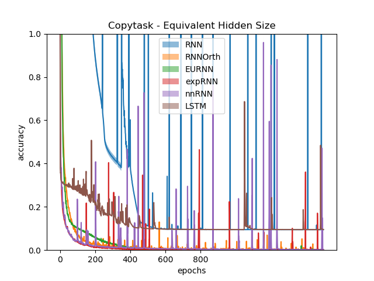
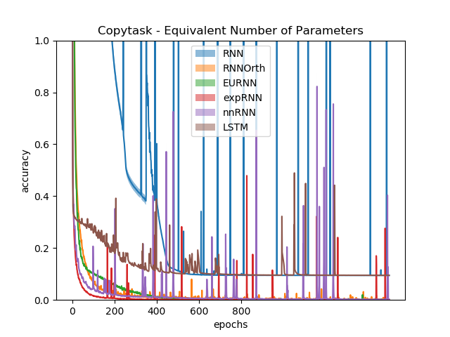

# Non-normal Recurrent Neural Network (nnRNN): learning long time dependencies while improving expressivity with transient dynamics

[nnRNN](https://arxiv.org/abs/1905.12080) - NeurIPS 2019

expRNN code taken from  [here](https://github.com/Lezcano/expRNN)

EURNN tests based on code taken from  [here](https://github.com/jingli9111/EUNN-tensorflow)

## Summary of Current Results
### Copytask




### Permuted Sequential MNIST


#### Hyperparameters for reported results

##### Copytask
  <table>
    <tr>
        <td>Model</td>
        <td>Hidden Size</td>
        <td>Optimizer</td>
        <td>LR</td>
        <td>Orth. LR</td>
        <td>δ</td>
        <td>T decay</td>
        <td>Recurrent init</td>
    </tr>
    <tr>
        <td>RNN</td>
        <td>128</td>
        <td>RMSprop &alpha;=0.9</td>
        <td>0.001</td>
        <td></td>
        <td></td>
        <td></td>
        <td>Glorot Normal</td>
    </tr>
    <tr>
        <td>RNN-orth</td>
        <td> 128</td>
        <td>RMSprop &alpha;=0.99 </td>
        <td>0.0002 </td>
        <td> </td>
        <td></td>
        <td></td>
        <td>Random Orth</td>
    </tr>
    <tr>
        <td>EURNN</td>
        <td> 128</td>
        <td>RMSprop &alpha;=0.5 </td>
        <td>0.001 </td>
        <td> </td>
        <td></td>
        <td></td>
        <td></td>
    </tr>
    <tr>
        <td>EURNN</td>
        <td> 256</td>
        <td>RMSprop &alpha;=0.5 </td>
        <td>0.001 </td>
        <td> </td>
        <td></td>
        <td></td>
        <td></td>
    </tr>
    <tr>
        <td>expRNN</td>
        <td> 128</td>
        <td>RMSprop &alpha;=0.99 </td>
        <td>0.001 </td>
        <td> 0.0001</td>
        <td></td>
        <td></td>
        <td>Henaff</td>
    </tr>
    <tr>
        <td>expRNN</td>
        <td> 176</td>
        <td>RMSprop &alpha;=0.99 </td>
        <td>0.001 </td>
        <td> 0.0001</td>
        <td></td>
        <td></td>
        <td>Henaff</td>
    </tr>
    <tr>
        <td>nnRNN</td>
        <td>128 </td>
        <td>  RMSprop &alpha; = 0.99 </td>
        <td>0.0005 </td>
        <td>10<sup>-6</sup> </td>
        <td>0.0001</td>
        <td>10<sup>-6</sup></td>
        <td>Cayley</td>
    </tr>

  </table>


##### sMNIST
  <table>
    <tr>
        <td>Model</td>
        <td>Hidden Size</td>
        <td>Optimizer</td>
        <td>LR</td>
        <td>Orth. LR</td>
        <td>&delta;</td>
        <td>T decay</td>
        <td>Recurrent init</td>
    </tr>
    <tr>
        <td>RNN</td>
        <td>512</td>
        <td>RMSprop &alpha;=0.9</td>
        <td>0.0001</td>
        <td></td>
        <td></td>
        <td></td>
        <td>Glorot Normal</td>
    </tr>
    <tr>
        <td>RNN-orth</td>
        <td> 512</td>
        <td>RMSprop &alpha;=0.99 </td>
        <td>5*10<sup>-5</sup> </td>
        <td> </td>
        <td></td>
        <td></td>
        <td>Random orth</td>
    </tr>
    <tr>
        <td>EURNN</td>
        <td> 512</td>
        <td>RMSprop &alpha;=0.9 </td>
        <td>0.0001 </td>
        <td> </td>
        <td></td>
        <td></td>
        <td></td>
    </tr>
    <tr>
        <td>EURNN</td>
        <td> 1024</td>
        <td>RMSprop &alpha;=0.9 </td>
        <td>0.0001 </td>
        <td> </td>
        <td></td>
        <td></td>
        <td></td>
    </tr>
    <tr>
        <td>expRNN</td>
        <td> 512</td>
        <td>RMSprop &alpha;=0.99 </td>
        <td>0.0005 </td>
        <td>5*10<sup>-5</sup> </td>
        <td></td>
        <td></td>
        <td>Cayley</td>
    </tr>
    <tr>
        <td>expRNN</td>
        <td>722</td>
        <td>RMSprop &alpha;=0.99 </td>
        <td>5*10<sup>-5</sup> </td>
        <td> </td>
        <td></td>
        <td></td>
        <td>Cayley</td>
    </tr>
    <tr>
        <td>nnRNN</td>
        <td>512 </td>
        <td> RMSprop &alpha;=0.99  </td>
        <td>0.0002 </td>
        <td>2*10<sup>-5</sup> </td>
        <td>0.1</td>
        <td>0.0001</td>
        <td>Cayley</td>
    </tr>
    <tr>
        <td>LSTM</td>
        <td>  512 </td>
        <td>  RMSprop &alpha;=0.99 </td>
        <td>0.0005 </td>
        <td> </td>
        <td></td>
        <td></td>
        <td>Glorot Normal</td>
    </tr>
        <tr>
        <td>LSTM</td>
        <td>  257 </td>
        <td>  RMSprop &alpha;=0.9 </td>
        <td>0.0005 </td>
        <td> </td>
        <td></td>
        <td></td>
        <td>Glorot Normal</td>
    </tr>
  </table>

## Usage

### Copytask

```
python copytask.py [args]
```
Options:
- net-type : type of RNN to use in test
- nhid : number if hidden units
- cuda : use CUDA
- T : delay between sequence lengths
- labels : number of labels in output and input, maximum 8
- c-length : sequence length
- onehot : onehot labels and inputs
- vari : variable length
- random-seed : random seed for experiment
- batch : batch size
- lr : learning rate for optimizer
- lr_orth : learning rate for orthogonal optimizer
- alpha : alpha value for optimizer (always RMSprop) 
- rinit : recurrent weight matrix initialization options: \[xavier, henaff, cayley, random orth.\]
- iinit : input weight matrix initialization, options: \[xavier, kaiming\]
- nonlin : non linearity type, options: \[None, tanh, relu, modrelu\]
- alam : strength of penalty on (&delta; in the paper)
- Tdecay : weight decay on upper triangular matrix values

### permuted sequtential MNIST

```
python sMNIST.py [args]
```

Options:
- net-type : type of RNN to use in test
- nhid : number if hidden units
- epochs : number of epochs
- cuda : use CUDA
- permute : permute the order of the input
- random-seed : random seed for experiment (excluding permute order which has independent seed)
- batch : batch size
- lr : learning rate for optimizer
- lr_orth : learning rate for orthogonal optimizer
- alpha : alpha value for optimizer (always RMSprop) 
- rinit : recurrent weight matrix initialization options: \[xavier, henaff, cayley, random orth.\]
- iinit : input weight matrix initialization, options: \[xavier, kaiming\]
- nonlin : non linearity type, options: \[None, tanh, relu, modrelu\]
- alam : strength of penalty on (&delta; in the paper)
- Tdecay : weight decay on upper triangular matrix values
- save_freq : frequency in epochs to save data and network
